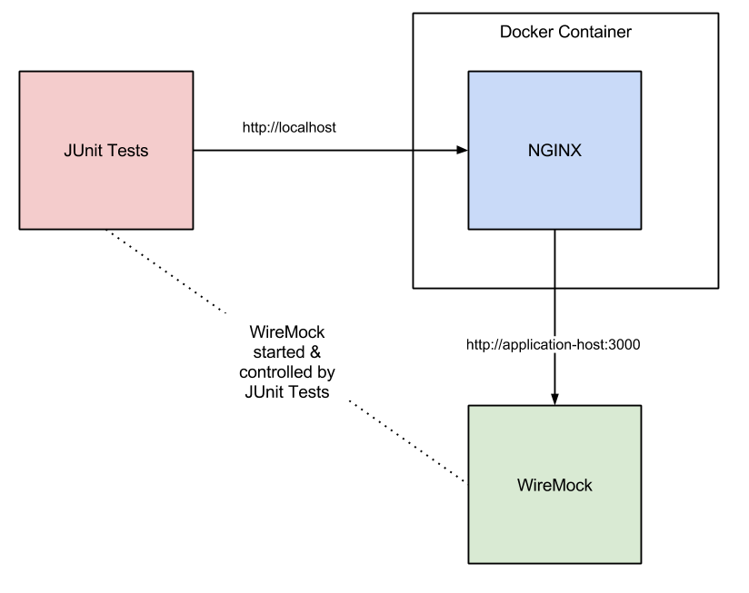

docker-nginx-reverse-proxy-with-tests
=====
Simple project that shows how to write automated tests for a dockerized NGINX instance with WireMock.

For more info, see my [blog post](http://phillbarber.blogspot.co.uk/2015/05/how-to-write-end-to-end-tests-for-nginx.html)

Environment Setup
=================
To run locally run...

```
./buildRunAndTest.sh
```

##Diagram


